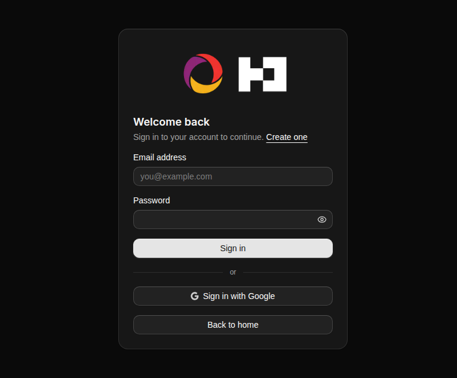
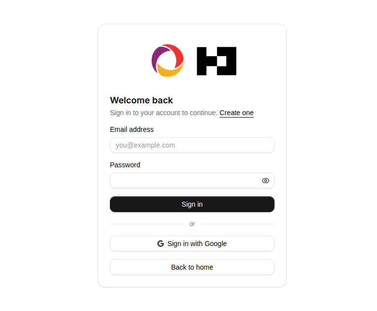
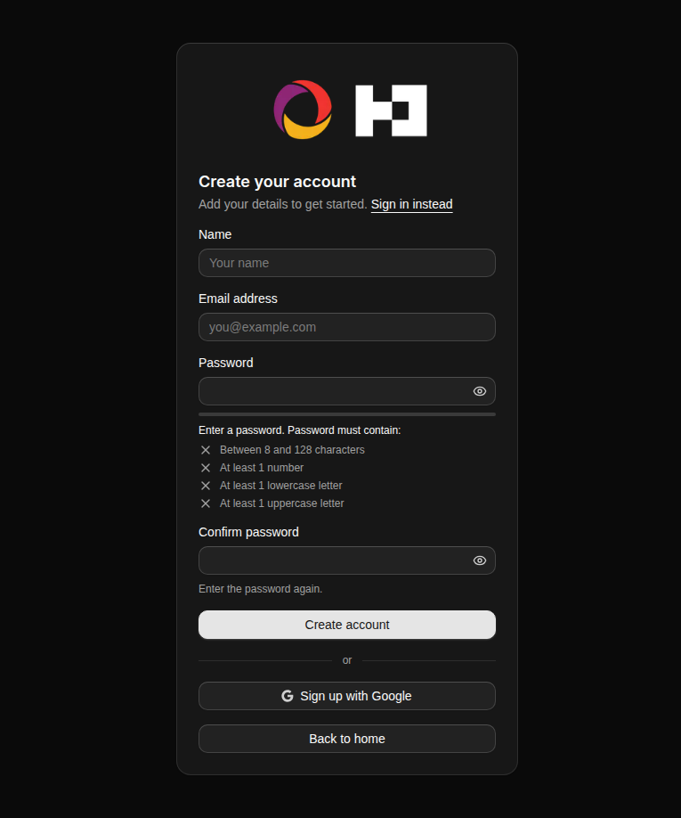
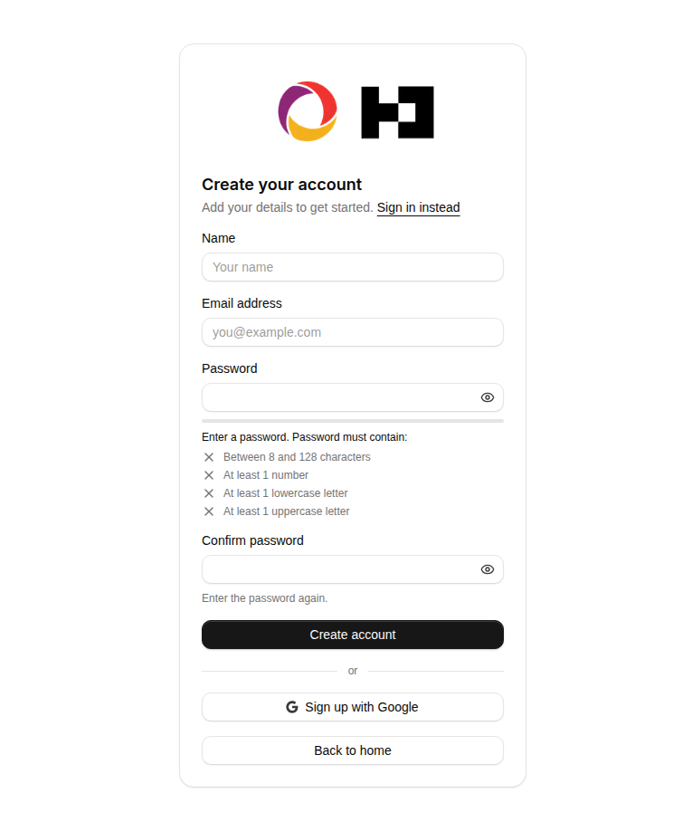
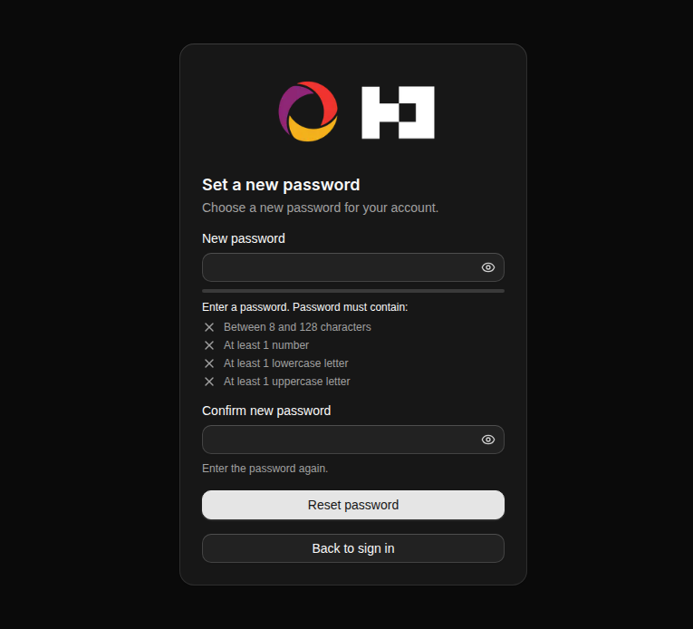
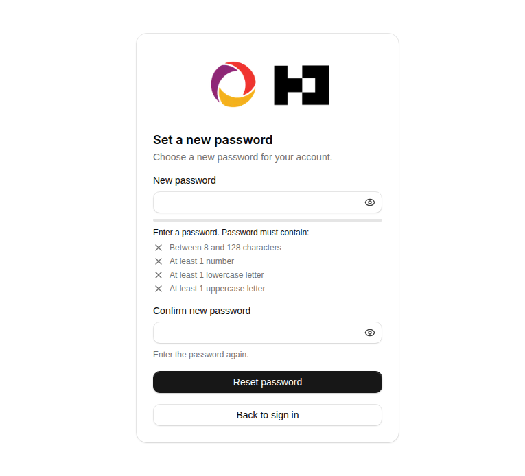

<p align="center">
  
  
</p>

<h1 align="center">Convex + Better Auth</h1>

<p align="center">A small Next.js App Router example with Convex-backed authentication.</p>

<p align="center">
  <a href="https://nextjs.org"></a>
  <a href="https://www.convex.dev"></a>
  <a href="https://www.better-auth.com"></a>
  <a href="https://tailwindcss.com"></a>
  <a href="https://bun.sh"></a>
  <a href="https://github.com/kacigaya/convex-betterauth/blob/main/LICENSE"></a>
</p>

The application supports verified email/password registration, sign-in, sign-out, password reset, authenticated server rendering, and optional Google OAuth. Resend delivers verification and reset emails. The home page is public and shows account details only when Convex validates the current session.

## Screenshots

| | Dark | Light |
| --- | --- | --- |
| Sign in |  |  |
| Create account |  |  |
| Reset password |  |  |

## Stack

- Next.js 16 and React 19
- Convex with `@convex-dev/better-auth`
- Better Auth
- TypeScript and Tailwind CSS 4
- [coss ui](https://coss.com/ui) components on Base UI
- Bun for package management and tests

## Requirements

- [Bun](https://bun.sh/)
- A [Convex](https://www.convex.dev/) account
- A [Resend](https://resend.com/) account for email/password flows

## Local setup

Clone and install the project:

```bash
git clone https://github.com/kacigaya/convex-betterauth.git
cd convex-betterauth
bun install
```

Start Convex and follow its prompts to create or select a development deployment:

```bash
bunx convex dev
```

The Convex CLI creates `.env.local` with `CONVEX_DEPLOYMENT`, `NEXT_PUBLIC_CONVEX_URL`, and `NEXT_PUBLIC_CONVEX_SITE_URL`. Keep that process running while developing.

Set the private Better Auth values on the Convex deployment, not in the Next.js environment:

```bash
bunx convex env set BETTER_AUTH_SECRET "$(openssl rand -base64 32)"
bunx convex env set SITE_URL http://localhost:3000
bunx convex env set RESEND_API_KEY your-resend-api-key
bunx convex env set EMAIL_FROM 'Convex Better Auth <onboarding@resend.dev>'
```

Resend's `onboarding@resend.dev` sender is suitable for local testing only and can send only to the email address associated with the Resend account. Set `EMAIL_FROM` to a sender on a verified Resend domain before testing with other recipients or deploying to production.

`.env.example` documents the frontend variables. If the Convex CLI has not created `.env.local` yet, copy it as a starting point:

```bash
cp .env.example .env.local
```

If `.env.local` already exists, do not run that copy command. Keep the Convex-generated values and add optional frontend settings manually.

Start Next.js in another terminal:

```bash
bun run dev
```

Open [http://localhost:3000](http://localhost:3000).

## Environment variables

Next.js reads these from `.env.local` or the hosting platform:

| Variable | Required | Purpose |
| --- | --- | --- |
| `CONVEX_DEPLOYMENT` | Development only | Selects the Convex deployment for CLI commands. |
| `NEXT_PUBLIC_CONVEX_URL` | Yes | Public Convex API URL. |
| `NEXT_PUBLIC_CONVEX_SITE_URL` | Yes | Public Convex HTTP Actions URL used by Better Auth. |
| `NEXT_PUBLIC_GOOGLE_AUTH_ENABLED` | No | Set to `true` only when Google credentials are configured on Convex. |

Convex deployment environment variables:

| Variable | Required | Purpose |
| --- | --- | --- |
| `BETTER_AUTH_SECRET` | Yes | Random secret with at least 32 characters. Use a different value per environment. |
| `SITE_URL` | Yes | Canonical Next.js origin, without a trailing slash. |
| `RESEND_API_KEY` | Yes | Private Resend API key used by Convex to deliver auth emails. |
| `EMAIL_FROM` | Yes | Resend sender address. Production senders must use a verified domain. |
| `GOOGLE_CLIENT_ID` | For Google OAuth | Google OAuth client ID. |
| `GOOGLE_CLIENT_SECRET` | For Google OAuth | Google OAuth client secret. |

Google credentials must be configured together:

```bash
bunx convex env set GOOGLE_CLIENT_ID your-client-id
bunx convex env set GOOGLE_CLIENT_SECRET your-client-secret
```

Then set `NEXT_PUBLIC_GOOGLE_AUTH_ENABLED=true` in the matching Next.js environment. The Google callback URL is:

```text
https://your-deployment.convex.site/api/auth/callback/google
```

`RESEND_API_KEY`, `EMAIL_FROM`, `BETTER_AUTH_SECRET`, and Google credentials belong only in the Convex deployment environment. Do not put them in `.env.local` or expose them through `NEXT_PUBLIC_*` variables.

## Email authentication behavior

Email/password registration requires ownership verification. Better Auth emails an `/api/auth/verify-email` link with `callbackURL=/email-verified`, then returns the browser to `/email-verified` with either success or a safe error code. Unverified accounts cannot sign in. Verification links expire after one hour, and successful verification does not sign the user in automatically.

The `/forgot-password` form requests a one-time reset link. Better Auth emails an `/api/auth/reset-password/:token` link with `callbackURL=/reset-password`. That callback validates the token before redirecting to `/reset-password?token=...`; invalid or expired links return an error instead. Reset links expire after one hour and cannot be replayed after use. A successful password reset revokes every active session for that user.

Registration and reset-request screens use generic responses so they do not disclose whether an account exists or whether a provider accepted a message. Email delivery has no console fallback. A missing Resend configuration stops the Convex auth module instead of printing links or silently disabling delivery.

Enabling required verification does not retroactively revoke sessions created before the setting was deployed. Revoke those sessions separately if this project already had active users before verification was enabled.

## Commands

```bash
bun run dev        # Start Next.js development mode
bun run lint       # Run ESLint
bun run typecheck  # Run TypeScript without emitting files
bun run test       # Run focused tests
bun run build      # Create the production build
bun run start      # Serve the production build
```

Run `bunx convex dev` while editing Convex functions. It generates the typed client API and validates the backend against the selected deployment.

## Continuous integration

GitHub Actions runs on pull requests and pushes to `main`. It installs with Bun 1.3.14 and `bun install --frozen-lockfile`, then runs lint, typecheck, tests, the production build, and `bun audit` in that order.

The build uses public placeholder Convex URLs and disables Google authentication. CI does not connect to Convex, Resend, or Google, and it does not require service credentials or repository secrets.

## Architecture

- `convex/auth.ts` owns Better Auth configuration, email delivery, password enforcement, rate limiting, and the authenticated user query.
- `convex/http.ts` exposes Better Auth through Convex HTTP Actions.
- `src/lib/auth-server.ts` centralizes the Next.js server integration.
- `src/app/api/auth/[...all]/route.ts` proxies same-origin auth requests to Convex.
- `src/app/page.tsx` preloads the authenticated Convex query with a server-issued token.
- `src/app/convex.tsx` hydrates the client provider with that token.
- `/login` and `/register` redirect authenticated sessions on the server.

The home route is intentionally public. Authentication changes what it renders; it is not a protected application route. Any future private Convex query or mutation must validate identity inside its Convex handler. UI checks and Next.js redirects are not authorization boundaries.

## Production deployment

1. Deploy Convex with `bunx convex deploy` and note the production `.cloud` and `.site` URLs.
2. Set `BETTER_AUTH_SECRET`, `SITE_URL`, `RESEND_API_KEY`, and a verified-domain `EMAIL_FROM` on the production Convex deployment. Add Google credentials there only if OAuth is enabled.
3. Configure the three public Next.js variables on the hosting platform. `NEXT_PUBLIC_GOOGLE_AUTH_ENABLED` must match the Convex OAuth configuration.
4. Build and deploy Next.js.
5. Test registration, verification, sign-in, sign-out, session persistence, password reset, email delivery, and any enabled OAuth callbacks against the production origin.

Do not reuse development secrets in production or expose Convex deployment secrets through `NEXT_PUBLIC_*` variables.

Follow [DEPLOYMENT_VERIFICATION.md](DEPLOYMENT_VERIFICATION.md) for the read-only smoke command, environment separation, and manual production verification matrix. All real infrastructure checks remain pending until someone with deployment access completes and records them.

## Deliberate limitation

The repository verifies auth behavior with a deterministic in-memory test adapter, but it cannot prove delivery from your Resend account or behavior on your deployed origin. Complete the production checks in [SECURITY_REVIEW.md](SECURITY_REVIEW.md) with real deployment credentials before relying on email identity as a trust signal.

## Documentation

- [Convex documentation](https://docs.convex.dev/)
- [Better Auth documentation](https://www.better-auth.com/docs)
- [Convex Better Auth component](https://labs.convex.dev/better-auth)
- [Next.js documentation](https://nextjs.org/docs)

## License

This project is open source.
